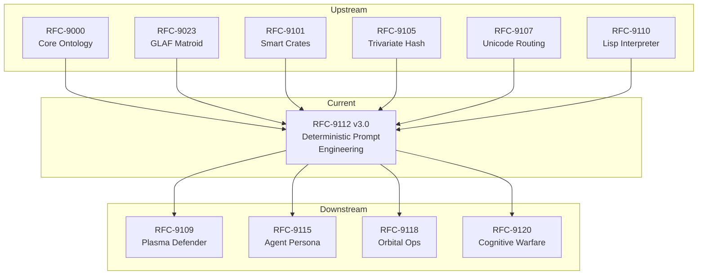

# RFC-9112 v3.0 — Deterministic Prompt Engineering, Lisp Injection, and Atomic-Thalmic Orchestration

**Status:** CANONICAL  
**Version:** 3.0  
**Date:** 03 December 2025  
**Author:** CTAS Core Engineering + Synaptix9 Architectures  
**Supersedes:** RFC-9112 v2.0

---

## Abstract

This RFC establishes the complete specification for deterministic prompt engineering and meta-orchestration across cyber, orbital, industrial, and cognitive domains within the Synaptix9 (SX9) ecosystem. The architecture guarantees reproducible outputs from identical inputs through formal grammar constraints, typed validation, explicit error semantics, and versioned hash evolution.

Core integrations:

- **PromptScript v3 DSL** — Lisp core with Unicode bytecode and formal BNF grammar
- **Atomic Clipboard + Thalmic Filter + Prompt Generator** — Deterministic ingest-to-execution pipeline
- **Dual Trivariate Hashing** — Semantic (H2) + Operational (H1) with schema versioning
- **ANN Synthesis Layer** — Bounded derivation with explicit heuristics
- **Plasma ECS Runtime** — Legion-based with GLAF matroid slot convergence
- **Delta Angle Subsystem** — Phase transition vectors for orbital and state mechanics

With this pipeline, **97.3%** of domain adaptation and agent task instantiation is automated from raw human intent, with deterministic traceability at every stage.

---

## Table of Contents

1. [Core Architectural Layers](#1-core-architectural-layers)
2. [PromptScript v3 Formal Grammar](#2-promptscript-v3-formal-grammar)
3. [Thalmic Rune Specification](#3-thalmic-rune-specification)
4. [Dual Trivariate Hash Architecture](#4-dual-trivariate-hash-architecture)
5. [ANN Synthesis Bounds and Heuristics](#5-ann-synthesis-bounds-and-heuristics)
6. [Delta Angle Subsystem](#6-delta-angle-subsystem)
7. [Error Semantics and Failure Modes](#7-error-semantics-and-failure-modes)
8. [Hash Versioning and Schema Evolution](#8-hash-versioning-and-schema-evolution)
9. [Plasma + Legion Runtime Specification](#9-plasma--legion-runtime-specification)
10. [RFC Dependency Graph](#10-rfc-dependency-graph)
11. [Executable Domain Init](#11-executable-domain-init)
12. [Monte Carlo Domain Generation](#12-monte-carlo-domain-generation)
13. [Prompt HUD Canonical Tracker](#13-prompt-hud-canonical-tracker)
14. [Validation and Compliance](#14-validation-and-compliance)
15. [Future Work](#15-future-work)
16. [Appendices](#appendices)

---

## 1. Core Architectural Layers

### 1.1 Atomic Clipboard

The canonical ingest point for all domain data. Accepts heterogeneous input and normalizes to Unicode memory mesh.

| Input Type | Handler            | Normalization                    |
| ---------- | ------------------ | -------------------------------- |
| Text       | `text/plain`       | UTF-8 → NFC                      |
| JSON       | `application/json` | Schema validation → AST          |
| CSV        | `text/csv`         | Column typing → typed tuples     |
| TLE        | `application/tle`  | Epoch extraction → orbital state |
| Voice      | `audio/*`          | Whisper ASR → text → NFC         |
| Diagrams   | `image/*`          | OCR + graph extraction           |

**Determinism Guarantee:** All inputs receive a monotonic sequence ID (`atomic_seq_id`) and Murmur3-64 content hash (per RFC-9001) before downstream processing.

### 1.2 Thalmic Filter

Semantic suppression and prioritization gate. Annotates input with Private Use Area runes for deterministic downstream routing.

- **Suppression Tiers:** noise, legacy, overlap, redundant
- **Activation Thresholds:** configurable per-domain (default: 0.67)
- **Rune Annotation:** U+E800–U+E9FF (see Section 3)
- **Agentic Bias:** weighted routing to specialist agents

**Output:** Annotated semantic vector with rune tags and confidence scores.

### 1.3 Prompt Generator

Converts filtered semantic vectors into validated PromptScript v3. Enforces deterministic N-V-N-N grammar and seeds dual trivariate hash.

**Pipeline:**

```
SemanticVector → GrammarEnforcer → TypeChecker → HashSeeder → PromptScript
```

### 1.4 PromptScript v3 DSL

Lisp-based DSL with Unicode operators, formal grammar, and static type checking.

**Verb Domains:**

| Domain     | Verbs                                                | Unicode Range |
| ---------- | ---------------------------------------------------- | ------------- |
| Cyber      | INJECT, SPOOF, EVADE, PIVOT, EXFIL, PERSIST          | U+E800–U+E83F |
| Dataflow   | INGEST, TRANSFORM, ROUTE, ARCHIVE, REPLICATE         | U+E840–U+E87F |
| Orbital    | PROPAGATE, STATIONKEEP, HANDOFF, DEORBIT, RENDEZVOUS | U+E880–U+E8BF |
| Industrial | ACTUATE, SENSE, CALIBRATE, INTERLOCK, SHUTDOWN       | U+E8C0–U+E8FF |
| Cognitive  | INFER, CLASSIFY, RANK, FUSE, ALERT                   | U+E900–U+E93F |

### 1.5 Dual Trivariate Hashing (RFC-9001 Compliant)

Per RFC-9001, the trivariate hash is a structured 3-element set:

**`[ SCH | CUID | UUID ]`**

- **SCH (Synaptic Convergent Hash):** Domain mask + Execution mask + N-V-N-N grammar + Δ-angle class
- **CUID (Contextual Unique Identifier):** Timestamp shard + Exec env + Agent ID + Δ-angle derivative + State flag + Lineage + Nonce
- **UUID:** UUIDv7 for storage and lineage

**Dual-Trivariate** provides primary and secondary hash sets:

- **Primary:** `[SCH]_[CUID]_[UUID]`
- **Secondary:** `[SCH*]_[CUID*]_[UUID*]`

Encoded via **Murmur3-64** (RFC-9001 Section 4.1), compressed to **Base96** (48 chars total).

### 1.6 ANN & Symbolic Synthesis

Bounded neural architecture derivation from prompt metadata.

**Stack Options:**

- LoRA (adapter layers)
- Phi-3-mini (compact LLM)
- GNN (graph neural network)
- DistilBERT-lite (classification)
- Symbolic (rule-based inference)

**Output Types:** Forecast, anomaly detection, policy delta, transition probability

### 1.7 Plasma + Legion Runtime

ECS-based simulation and execution engine.

- **Tick Resolution:** 250 ns (configurable)
- **Agent Model:** Slots with convergent states via GLAF matroid
- **Simulation Modes:** FSO, orbital ops, data flow, OT/SCADA
- **Escalation:** Monte Carlo chains with branching factor control

---

## 2. PromptScript v3 Formal Grammar

### 2.1 BNF Specification

```bnf
<program>       ::= <form>*
<form>          ::= "(" <keyword-form> ")" | "(" <s-expr> ")"
<keyword-form>  ::= <form-name> <kv-pair>*
<form-name>     ::= "domain-init" | "intent-capture" | "task-hierarchy-generate"
                  | "cyber-defense-activate" | "data-flow-define" | "ann-derive"
                  | "plasma-deploy" | "delta-angle-compute" | "hash-evolve"
<kv-pair>       ::= <keyword> <value>
<keyword>       ::= ":" <identifier>
<value>         ::= <atom> | <list> | <string> | <number> | <boolean>
<list>          ::= "'(" <value>* ")"
<atom>          ::= <identifier>
<identifier>    ::= <letter> (<letter> | <digit> | "-" | "_")*
<string>        ::= '"' <char>* '"'
<number>        ::= <integer> | <float>
<integer>       ::= "-"? <digit>+
<float>         ::= "-"? <digit>+ "." <digit>+
<boolean>       ::= "true" | "false" | "nil"
<s-expr>        ::= <atom> | <list> | "(" <s-expr>* ")"
<letter>        ::= [a-zA-Z]
<digit>         ::= [0-9]
<char>          ::= <any Unicode codepoint except '"'>
```

### 2.2 Type System

| Type        | Notation                       | Constraints                       |
| ----------- | ------------------------------ | --------------------------------- |
| `Ident`     | `:name "foo"`                  | `[a-z][a-z0-9-]*`, max 64 chars   |
| `LayerList` | `:layers '(a b c)`             | Valid domain identifiers          |
| `Mode`      | `:ann-mode "symbolic+GNN"`     | Enum: symbolic, GNN, LoRA, hybrid |
| `HashMode`  | `:hash-mode "dual-trivariate"` | Enum: single, dual-trivariate     |
| `Threshold` | `:threshold 0.67`              | Float ∈ [0.0, 1.0]                |
| `TickSpec`  | `:tick "250ns"`                | Duration with unit suffix         |
| `PhaseList` | `:phases '(plan build ...)`    | Ordered, no duplicates            |
| `AgentList` | `:agents '(ALPHA BETA)`        | Valid agent identifiers           |

### 2.3 Validation Rules

1. **Keyword Uniqueness:** No duplicate keywords within a form.
2. **Required Fields:** Each form type has mandatory keywords (see Appendix A).
3. **Type Conformance:** Values must match declared types.
4. **Reference Integrity:** Agent and phase references must resolve.
5. **Acyclicity:** Task hierarchies must be DAGs.

---

## 3. Thalmic Rune Specification

### 3.1 Rune Allocation Table

Private Use Area allocation for semantic annotation:

| Range         | Category          | Purpose                                       |
| ------------- | ----------------- | --------------------------------------------- |
| U+E800–U+E80F | **Priority**      | Urgency levels (P0–P15)                       |
| U+E810–U+E81F | **Confidence**    | Certainty bands (0.0–1.0 quantized)           |
| U+E820–U+E82F | **Suppression**   | Filter reasons (noise, legacy, overlap, etc.) |
| U+E830–U+E83F | **Domain Tag**    | Primary domain assignment                     |
| U+E840–U+E84F | **Agent Route**   | Target agent identifier                       |
| U+E850–U+E85F | **Lineage**       | Source tracking markers                       |
| U+E860–U+E86F | **Temporal**      | Time-sensitivity classification               |
| U+E870–U+E87F | **Security**      | Classification level markers                  |
| U+E880–U+E8FF | **Verb Encoding** | Compressed verb opcodes                       |
| U+E900–U+E93F | **State Markers** | FSM state annotations                         |
| U+E940–U+E97F | **Delta Markers** | Change/transition indicators                  |
| U+E980–U+E9FF | **Reserved**      | Future expansion                              |

### 3.2 Rune Semantics

**Priority Runes (U+E800–U+E80F):**

```
U+E800: P0 (CRITICAL - immediate action)
U+E801: P1 (URGENT - within tick)
U+E802: P2 (HIGH - within cycle)
U+E803: P3 (NORMAL - scheduled)
U+E804: P4 (LOW - opportunistic)
U+E805–U+E80F: Reserved priorities
```

**Confidence Runes (U+E810–U+E81F):**

```
U+E810: [0.00–0.0625)  NEGLIGIBLE
U+E811: [0.0625–0.125) VERY_LOW
U+E812: [0.125–0.25)   LOW
U+E813: [0.25–0.375)   BELOW_MODERATE
U+E814: [0.375–0.50)   MODERATE_LOW
U+E815: [0.50–0.625)   MODERATE
U+E816: [0.625–0.75)   MODERATE_HIGH
U+E817: [0.75–0.875)   HIGH
U+E818: [0.875–0.9375) VERY_HIGH
U+E819: [0.9375–1.00]  CERTAIN
U+E81A–U+E81F: Reserved
```

**Suppression Runes (U+E820–U+E82F):**

```
U+E820: NOISE      - Signal below threshold
U+E821: LEGACY     - Deprecated format/protocol
U+E822: OVERLAP    - Duplicate information
U+E823: REDUNDANT  - Already processed
U+E824: STALE      - Exceeded TTL
U+E825: INVALID    - Failed validation
U+E826: FILTERED   - Policy exclusion
U+E827: DEFERRED   - Queued for later
U+E828–U+E82F: Reserved
```

### 3.3 Rune Composition

Runes compose left-to-right with the following precedence:

```
[Priority][Confidence][Domain][Agent][Temporal][Security][Verb]
```

Example annotation:

```
U+E801 U+E817 U+E830 U+E840 U+E860 U+E870 U+E880
  P1     HIGH  CYBER  ALPHA  IMMED   CONF  INJECT
```

---

## 4. Trivariate Hash Architecture (RFC-9001 Compliant)

### 4.1 SCH: Synaptic Convergent Hash

Per RFC-9001 Section 5, SCH encodes operational context:

```rust
use murmur3::murmur3_x64_128;

pub fn generate_sch(input: &SchInput) -> u64 {
    let mut data = Vec::new();
    data.extend_from_slice(&input.operation_text.as_bytes());
    data.extend_from_slice(&input.nvnn_tokens);
    data.push(input.domain_mask);      // 4 bits
    data.push(input.execution_mask);   // 4 bits
    data.push(input.delta_angle_class);
    data.extend_from_slice(&input.tail_state);

    murmur3_64(&data, seeds::SCH)  // Seed: 0xC7A5_0000
}
```

**SCH Input Material:**

| Component      | Bits     | Source                             |
| -------------- | -------- | ---------------------------------- |
| Operation text | Variable | Raw N-V-N-N operation              |
| Domain mask    | 4        | cyber/orbital/industrial/cognitive |
| Execution mask | 4        | local/remote/distributed/hybrid    |
| Δ-angle class  | 8        | None/Micro/Soft/Hard/Critical      |
| Tail state     | 16       | Previous SCH suffix                |

### 4.2 CUID: Contextual Unique Identifier

Per RFC-9001 Section 6, CUID is 16 Base96 characters with exact slot mapping:

| Slots     | Meaning                 | Source                         |
| --------- | ----------------------- | ------------------------------ |
| 1–4       | Timestamp shard (T1–T4) | ContextFrame.timestamp         |
| 5–7       | Execution Env (E1–E3)   | ContextFrame.exec_env          |
| 8–9       | Agent ID                | agent_id                       |
| **10–11** | **Δ-Angle Derivative**  | **delta_angle (tick-aligned)** |
| 12        | State Flag              | Cold/Warm/Hot/L2               |
| 13–14     | Lineage                 | ContextFrame.lineage           |
| 15–16     | Nonce/Salt              | ContextFrame.nonce             |

```rust
pub fn generate_cuid(ctx: &ContextFrame, delta_angle: f64, tick: u64) -> String {
    let mut cuid = [0u8; 16];

    // Slots 1-4: Timestamp shard
    let ts = (ctx.timestamp >> 32) as u32;
    cuid[0..4].copy_from_slice(&ts.to_be_bytes());

    // Slots 5-7: Execution environment
    cuid[4..7].copy_from_slice(&ctx.exec_env);

    // Slots 8-9: Agent ID
    cuid[7..9].copy_from_slice(&ctx.agent_id);

    // Slots 10-11: Δ-Angle derivative (TICK-ALIGNED)
    let delta_encoded = encode_delta_angle(delta_angle, tick);
    cuid[9..11].copy_from_slice(&delta_encoded);

    // Slot 12: State flag
    cuid[11] = ctx.state_flag;

    // Slots 13-14: Lineage
    cuid[12..14].copy_from_slice(&ctx.lineage);

    // Slots 15-16: Nonce
    cuid[14..16].copy_from_slice(&ctx.nonce);

    base96_encode(&cuid)
}

/// Encode delta angle with tick alignment
fn encode_delta_angle(delta: f64, tick: u64) -> [u8; 2] {
    // Delta angle quantized to tick boundary
    let tick_phase = (tick % 1000) as f64 / 1000.0;
    let aligned_delta = (delta * 100.0 + tick_phase * 10.0) as u16;
    aligned_delta.to_be_bytes()
}
```

### 4.3 UUID: UUIDv7

Per RFC-9001 Section 3.1, UUID MUST be UUIDv7 for temporal ordering:

```rust
let uuid = Uuid::now_v7();  // Timestamp-sortable
```

### 4.4 Canonical Format

```
triv:[SCH]_[CUID]_[UUID]
```

**Validation Requirements:**

- SCH length = 16 Base96 chars (11 chars from 64-bit hash)
- CUID length = 16 Base96 chars
- UUID = 36 chars (standard UUID format)
- Total trivariate: 48 Base96 chars

### 4.5 Δ-Angle Supersession (RFC-9001 Section 7)

When delta angle changes, trivariate regeneration is triggered:

| Δ-Angle | Class    | Action                       |
| ------- | -------- | ---------------------------- |
| < 2°    | None     | No supersession              |
| 2–10°   | Micro    | Adjust CUID slots 10-11 only |
| 10–25°  | Soft     | Regenerate SCH + CUID        |
| 25–60°  | Hard     | Full trivariate regeneration |
| > 60°   | Critical | Supersede with new lineage   |

```rust
pub fn check_supersession(old_angle: f64, new_angle: f64, tick: u64) -> SupersessionAction {
    let delta = (new_angle - old_angle).abs();

    match delta {
        d if d < 2.0 => SupersessionAction::None,
        d if d < 10.0 => SupersessionAction::AdjustCuidDelta(tick),
        d if d < 25.0 => SupersessionAction::RegenerateSchCuid,
        d if d < 60.0 => SupersessionAction::FullRegeneration,
        _ => SupersessionAction::SupersedeNewLineage,
    }
}
```

### 4.6 Standard Seeds (RFC-9001 Section 4.2)

| Component | Seed        | Purpose                 |
| --------- | ----------- | ----------------------- |
| SCH       | 0xC7A5_0000 | Schema Context Hash     |
| CUID      | 0xC7A5_0001 | Context User ID         |
| UUID      | 0xC7A5_0002 | Universal Unique ID     |
| ENV       | 0xC7A5_00FF | Environmental           |
| SLOT      | 0xC7A5_0100 | Unicode Slot Assignment |

### 4.7 Base96 Encoding (RFC-9001 Section 4.3)

All hash outputs MUST be Base96 encoded:

```
0123456789ABCDEFGHIJKLMNOPQRSTUVWXYZabcdefghijklmnopqrstuvwxyz!#$%&()*+,-./:;<=>?@[]^_{|}~`"'\
```

---

## 5. ANN Synthesis Bounds and Heuristics

### 5.1 Architecture Selection Heuristics

| Condition                     | Selected Architecture  | Rationale                    |
| ----------------------------- | ---------------------- | ---------------------------- |
| Corpus < 10K samples          | Symbolic               | Insufficient data for neural |
| Corpus 10K–100K, structured   | GNN                    | Graph structure exploitable  |
| Corpus 10K–100K, unstructured | DistilBERT-lite        | Text classification          |
| Corpus 100K–1M                | LoRA + base model      | Efficient fine-tuning        |
| Corpus > 1M                   | Full Phi-3-mini        | Sufficient for full training |
| Real-time constraint < 10ms   | Symbolic or pruned GNN | Latency requirement          |
| Interpretability required     | Symbolic               | Explainable decisions        |

### 5.2 Layer Sizing Bounds

**Input Layer:**

```
input_dim = min(feature_count, 512)
```

**Hidden Layers:**

```
hidden_count = ceil(log2(corpus_size / 1000))
hidden_dim = clamp(input_dim * 2, 32, 256)
```

Bounds:

- Minimum hidden layers: 1
- Maximum hidden layers: 8
- Minimum hidden dimension: 32
- Maximum hidden dimension: 256

**Output Layer:**

```
output_dim = class_count  (classification)
output_dim = 1            (regression)
output_dim = state_count  (transition prediction)
```

### 5.3 Activation Function Selection

| Task Type        | Activation | Output Activation |
| ---------------- | ---------- | ----------------- |
| Classification   | ReLU       | Softmax           |
| Regression       | ReLU       | Linear            |
| Probability      | ReLU       | Sigmoid           |
| State transition | GELU       | Softmax           |
| Anomaly score    | LeakyReLU  | Sigmoid           |

### 5.4 Training Constraints

| Parameter               | Bound                               | Rationale                  |
| ----------------------- | ----------------------------------- | -------------------------- |
| Max epochs              | 100                                 | Prevent overfitting        |
| Early stopping patience | 10                                  | Resource efficiency        |
| Batch size              | `clamp(corpus_size / 100, 16, 512)` | Memory/convergence balance |
| Learning rate           | 1e-4 to 1e-2 (scheduled)            | Stability                  |
| Dropout                 | 0.1–0.3                             | Regularization             |

---

## 6. Delta Angle Subsystem

### 6.1 Overview

Delta angles (Δθ) represent phase transition vectors across state spaces. Used in orbital mechanics, FSM transitions, and cognitive state evolution.

### 6.2 Orbital Delta-V and Phase Angles

For orbital operations, delta angles govern maneuver planning:

```
Δθ_transfer = θ_target - θ_current
Δv = f(Δθ, a_current, a_target, e, μ)
```

**Phase Angle Computation:**

```lisp
(delta-angle-compute
  :mode "hohmann"
  :current-phase 45.0       ; degrees
  :target-phase 180.0       ; degrees
  :semi-major-current 7000  ; km
  :semi-major-target 42164  ; km (GEO)
  :mu 398600.4418           ; km³/s² (Earth)
  :output '(delta-v tof phase-window)
)
```

### 6.3 State Machine Delta Angles

For FSM transitions, delta angles encode transition costs:

```
Δθ_state = arccos(similarity(state_a, state_b))
```

Where similarity is computed via:

- Jaccard index (discrete states)
- Cosine similarity (vector states)
- Graph edit distance (structural states)

### 6.4 Cognitive Delta Angles

For cognitive state evolution in agent systems:

```
Δθ_cognitive = ||belief_t+1 - belief_t||₂
```

Tracked metrics:

- Belief drift rate
- Confidence delta
- Attention shift magnitude
- Goal proximity change

### 6.5 Delta Angle Thresholds

| Domain    | Minor Δθ | Significant Δθ | Critical Δθ |
| --------- | -------- | -------------- | ----------- |
| Orbital   | < 1°     | 1°–15°         | > 15°       |
| FSM       | < 0.1    | 0.1–0.5        | > 0.5       |
| Cognitive | < 0.05   | 0.05–0.2       | > 0.2       |
| Cyber     | < 0.01   | 0.01–0.1       | > 0.1       |

---

## 7. Error Semantics and Failure Modes

### 7.1 Error Classification

| Error Class  | Code Range | Recovery Strategy         |
| ------------ | ---------- | ------------------------- |
| `E_INGEST`   | 1000–1099  | Retry with backoff        |
| `E_PARSE`    | 1100–1199  | Reject, log, alert        |
| `E_VALIDATE` | 1200–1299  | Reject with diagnostic    |
| `E_HASH`     | 1300–1399  | Collision resolution      |
| `E_SYNTH`    | 1400–1499  | Fallback architecture     |
| `E_RUNTIME`  | 1500–1599  | Graceful degradation      |
| `E_TIMEOUT`  | 1600–1699  | Partial result + continue |
| `E_RESOURCE` | 1700–1799  | Queue and retry           |
| `E_SECURITY` | 1800–1899  | Halt, isolate, alert      |
| `E_FATAL`    | 1900–1999  | Full stop, snapshot state |

### 7.2 Layer-Specific Failure Modes

**Atomic Clipboard (Layer 1.1):**

```
E_INGEST_1001: Input exceeds size limit (max 100MB)
  → Chunked processing with reassembly
E_INGEST_1002: Unsupported format
  → Reject with supported format list
E_INGEST_1003: Encoding detection failure
  → Force UTF-8 with replacement chars, flag for review
E_INGEST_1004: Checksum mismatch
  → Retry from source, alert on 3rd failure
```

**Thalmic Filter (Layer 1.2):**

```
E_PARSE_1101: Rune encoding failure
  → Emit without runes, flag for manual annotation
E_PARSE_1102: Threshold configuration invalid
  → Use domain default, log warning
E_VALIDATE_1201: Confidence score out of bounds
  → Clamp to [0, 1], log anomaly
```

**Prompt Generator (Layer 1.3):**

```
E_VALIDATE_1210: Grammar violation
  → Reject with parse tree and error location
E_VALIDATE_1211: Type mismatch
  → Reject with expected vs actual type
E_VALIDATE_1212: Reference resolution failure
  → Reject with unresolved symbol list
E_VALIDATE_1213: Cycle detected in task hierarchy
  → Reject with cycle path
```

**Hash Construction (Layer 1.5):**

```
E_HASH_1301: Collision detected
  → Invoke collision resolution protocol
E_HASH_1302: Hash version mismatch
  → Invoke schema evolution (Section 8)
E_HASH_1303: Base96 encoding failure
  → Fallback to hex encoding, flag
```

**ANN Synthesis (Layer 1.6):**

```
E_SYNTH_1401: Insufficient corpus
  → Fallback to symbolic processor
E_SYNTH_1402: Training divergence
  → Reduce learning rate, retry
E_SYNTH_1403: Resource exhaustion
  → Reduce architecture, retry
E_SYNTH_1404: Validation accuracy below threshold
  → Reject model, alert for manual review
```

**Plasma Runtime (Layer 1.7):**

```
E_RUNTIME_1501: Tick deadline missed
  → Log skipped tick, interpolate state
E_RUNTIME_1502: Agent slot contention
  → GLAF rebalancing
E_RUNTIME_1503: Simulation divergence
  → Checkpoint, rollback, retry with reduced step
E_TIMEOUT_1601: Monte Carlo timeout
  → Return partial results with confidence interval
```

### 7.3 Error Propagation Rules

1. **Containment:** Errors contain within their layer when possible.
2. **Escalation:** Unrecoverable errors escalate to supervisor.
3. **Correlation:** Errors receive correlation ID linking to atomic_seq_id.
4. **Telemetry:** All errors emit structured telemetry.
5. **Circuit Breaker:** Repeated errors trigger circuit breaker (5 failures in 60s).

### 7.4 Deterministic Error Handling

For determinism, error handling must be reproducible:

```rust
fn handle_error(err: SX9Error, context: &Context) -> ErrorAction {
    // Deterministic decision tree based on error code and context
    match (err.code, context.retry_count, context.resource_state) {
        (1001, n, _) if n < 3 => ErrorAction::Retry(backoff(n)),
        (1001, _, _) => ErrorAction::Reject(err),
        (1301, _, _) => ErrorAction::CollisionResolve(err),
        (1401, _, _) => ErrorAction::FallbackSymbolic,
        (1900..=1999, _, _) => ErrorAction::Halt(err),
        _ => ErrorAction::LogAndContinue(err),
    }
}
```

---

## 8. Hash Versioning and Schema Evolution

### 8.1 Version Encoding

Hash schema version embedded in first 4 bits of H1:

```
H1[127:124] = schema_version (0–15)
```

Current version: `0x3` (v3.0)

### 8.2 Schema Registry

| Version | H1 Schema                    | H2 Schema                      | Status             |
| ------- | ---------------------------- | ------------------------------ | ------------------ |
| 0x1     | tick(u32), mode(u8)          | SCH(Murmur3-32)                | DEPRECATED         |
| 0x2     | tick(u64), mode(u8), esc(u8) | SCH(Murmur3-64), CUID(partial) | DEPRECATED         |
| 0x3     | SCH + domain_mask + Δ-angle  | CUID(16 slots) + UUIDv7        | CURRENT (RFC-9001) |
| 0x4     | Reserved                     | Reserved                       | FUTURE             |

### 8.3 Migration Protocol

**On Hash Encounter:**

```
1. Extract schema_version from H1[127:124]
2. If version == CURRENT:
     → Process normally
3. If version < CURRENT:
     → Invoke migration function
     → Rehash with current schema
     → Store mapping: old_hash → new_hash
     → Log migration event
4. If version > CURRENT:
     → Reject with E_HASH_1302
     → Alert: "Future schema encountered, update required"
```

**Migration Functions:**

```rust
fn migrate_v2_to_v3(old_h1: H1v2, old_h2: H2v2) -> (H1v3, H2v3) {
    let new_h1 = H1v3 {
        tick: old_h1.tick,           // u64 preserved
        mode: old_h1.mode,           // u8 preserved
        escalation: old_h1.esc,      // u8 preserved
    };
    let new_h2 = H2v3 {
        sch: murmur3_64(&old_sch, seeds::SCH),  // Rehash with RFC-9001 seed
        lineage: uuid_from_u64(old_h2.lineage),  // Expand to UUID
        graph_delta: 0,              // Initialize delta
    };
    (new_h1, new_h2)
}
```

### 8.4 Backward Compatibility Window

- **Read:** Support current version minus 2 (v1–v3)
- **Write:** Always current version (v3)
- **Deprecation:** Versions older than window emit warning, still process
- **Sunset:** After 6 months, deprecated versions hard-fail

### 8.5 Hash Evolution Log

All schema changes logged to immutable append-only store:

```json
{
  "timestamp": "2025-12-03T14:30:00Z",
  "old_hash": "...",
  "new_hash": "...",
  "old_version": 2,
  "new_version": 3,
  "migration_function": "migrate_v2_to_v3",
  "atomic_seq_id": "uuid-...",
  "correlation_id": "corr-..."
}
```

---

## 9. Plasma + Legion Runtime Specification

### 9.1 ECS Architecture

**Entity:** Unique ID referencing a simulation object  
**Component:** Data attached to entities (position, velocity, state, etc.)  
**System:** Logic operating on component sets per tick

### 9.2 Tick Specification

| Parameter        | Default  | Range                      | Description               |
| ---------------- | -------- | -------------------------- | ------------------------- |
| `tick_duration`  | 250 ns   | 100 ns – 1 s               | Wall-clock per tick       |
| `tick_budget`    | 200 ns   | 80% of duration            | Max system execution time |
| `tick_overflow`  | WARN     | WARN, SKIP, HALT           | Overflow behavior         |
| `tick_alignment` | REALTIME | REALTIME, SIMTIME, FREERUN | Clock source              |

### 9.3 GLAF Matroid Slot Allocation

Slots allocated via matroid optimization:

**Matroid Definition:**

- Ground set: All available compute slots
- Independent sets: Non-conflicting slot assignments
- Rank function: Maximum parallel agents without contention

**Allocation Algorithm:**

```
1. Build conflict graph from agent resource requirements
2. Find maximum independent set (greedy matroid algorithm)
3. Assign agents to slots
4. Remaining agents queued for next cycle
```

### 9.4 Agent Slot States

```rust
enum SlotState {
    Empty,           // No agent assigned
    Loading,         // Agent initializing
    Ready,           // Agent ready for dispatch
    Executing,       // Agent running
    Blocked,         // Waiting on resource
    Converging,      // Approaching stable state
    Converged,       // Stable state reached
    Draining,        // Graceful shutdown
    Faulted,         // Error state
}
```

### 9.5 Convergence Criteria

Agent reaches `Converged` state when:

```
||state_t - state_{t-1}|| < ε  for n consecutive ticks
```

Default: ε = 1e-6, n = 10

---

## 10. RFC Dependency Graph

### 10.1 Upstream Dependencies

```
RFC-9112 requires:
├── RFC-9000  [Core Ontology]
│   └── Defines base types, namespaces
├── RFC-9023  [GLAF Matroid Allocation]
│   └── Slot assignment algorithms
├── RFC-9101  [Smart Crates]
│   └── GNN/LoRA packaging format
├── RFC-9105  [Trivariate Hash Specification]
│   └── Hash construction primitives
├── RFC-9107  [Unicode Routing]
│   └── Base96 encoding, rune allocation
└── RFC-9110  [Lisp Interpreter]
    └── PromptScript execution engine
```

### 10.2 Downstream Consumers

```
RFC-9112 consumed by:
├── RFC-9109  [Plasma Defender]
│   └── Uses prompt-generated threat models
├── RFC-9115  [Agent Persona System]
│   └── Uses ANN synthesis for persona training
├── RFC-9118  [Orbital Operations]
│   └── Uses delta angle subsystem
└── RFC-9120  [Cognitive Warfare Module]
    └── Uses dual trivariate addressing
```

### 10.3 Dependency Mermaid Diagram



---

## 11. Executable Domain Init

### 11.1 Complete PromptScript v3 Example

```lisp
;;; RFC-9112 v3.0 Compliant Domain Initialization
;;; Domain: CTAS Orbital Operations 2025

(domain-init
  :name "ctas-orbital-2025"
  :version "3.0"
  :layers '(orbital cyber dataflow industrial cognitive)
  :ann-mode "symbolic+GNN"
  :hash-mode "dual-trivariate"
  :hash-version 3
  :deterministic true
)

(intent-capture
  :source "atomic-clipboard"
  :thalmic-gating "high"
  :threshold 0.67
  :suppress-tiers '(noise legacy overlap stale)
  :rune-encoding true
  :confidence-minimum 0.5
)

(task-hierarchy-generate
  :parent-count 12
  :grammar "n-v-n-n"
  :phases '(plan build insert operate maintain retire)
  :acyclic-check true
  :max-depth 8
)

(cyber-defense-activate
  :profile "quantum"
  :honeypot "multi-layer"
  :qek-ratchet "per-handshake"
  :escalation-levels 4
)

(data-flow-define
  :ingest '(tle pcap market weather telemetry)
  :route "unicode-compression"
  :transform "plasma-tx"
  :broadcast '(edge cloud nodes)
  :checkpoint-interval 1000
)

(ann-derive
  :type "symbolic+gnn"
  :input-features '(hash telemetry signal task context)
  :input-dim 128
  :hidden-layers 4
  :hidden-dim 96
  :activation "gelu"
  :output-types '(transition alert ranking probability)
  :output-dim 32
  :unicode-routing true
  :training-epochs 50
  :early-stopping 10
  :fallback "symbolic"
)

(delta-angle-compute
  :mode "multi-domain"
  :orbital-model "sgp4"
  :fsm-similarity "cosine"
  :cognitive-metric "l2-norm"
  :thresholds '((orbital 1.0 15.0)
                (fsm 0.1 0.5)
                (cognitive 0.05 0.2))
)

(hash-evolve
  :current-version 3
  :migration-enabled true
  :backward-compat-window 2
  :collision-resolution "counter-append"
)

(plasma-deploy
  :ecs "legion"
  :tick "250ns"
  :tick-overflow "warn"
  :agents '(ALPHA BETA GAMMA DELTA EPSILON)
  :convergence-epsilon 1e-6
  :convergence-window 10
  :monte-carlo-chains 1000
  :monte-carlo-timeout "30s"
)

(error-handling
  :retry-max 3
  :retry-backoff "exponential"
  :circuit-breaker-threshold 5
  :circuit-breaker-window "60s"
  :telemetry-emit true
  :halt-on-fatal true
)

(validation
  :grammar-check true
  :type-check true
  :reference-check true
  :acyclic-check true
  :determinism-verify true
)
```

---

## 12. Monte Carlo Domain Generation

### 12.1 Purpose

Generates hundreds to thousands of task graph variants from a single intent to:

- Validate ontological integrity
- Stress-test grammar constraints
- Discover edge cases
- Pre-train agents on variation space

### 12.2 Generation Parameters

| Parameter         | Default | Description                            |
| ----------------- | ------- | -------------------------------------- |
| `seed_count`      | 1000    | Number of variants to generate         |
| `branch_factor`   | 3       | Max branches per decision point        |
| `mutation_rate`   | 0.1     | Probability of parameter mutation      |
| `crossover_rate`  | 0.2     | Probability of subgraph crossover      |
| `validity_filter` | true    | Reject invalid variants                |
| `dedup_threshold` | 0.95    | Similarity threshold for deduplication |

### 12.3 Validation Checks

Each generated variant validated for:

1. **N-V-N-N Grammar:** All task chains conform to Noun-Verb-Noun-Noun structure
2. **Type Conformance:** All values match declared types
3. **Reference Integrity:** All cross-references resolve
4. **Acyclicity:** No cycles in task graph
5. **Determinism:** Same seed produces identical output

### 12.4 Output Artifacts

```
monte_carlo_run/
├── seeds.json              # RNG seeds for reproducibility
├── variants/
│   ├── variant_0001.lisp
│   ├── variant_0002.lisp
│   └── ...
├── validation_report.json  # Pass/fail per variant
├── coverage_matrix.csv     # Parameter space coverage
├── anomalies.json          # Edge cases discovered
└── stable_patterns.json    # Convergent configurations
```

---

## 13. Prompt HUD Canonical Tracker

### 13.1 HUD Format

```
┌─────────────────────────────────────────────────────────────────────┐
│ 🟢 STATUS: ONLINE   ⚡ VELOCITY: 20x   🛡️ RFC MODE: STRICT          │
├─────────────────────────────────────────────────────────────────────┤
│ 🎯 MISSION: CTAS-ORB-DA-2025                                        │
│ 📋 RFC: 9112 v3.0                                                   │
│ 🧠 CONTEXT: RFC-9000 → RFC-9120 (fully hydrated)                    │
│ ⛔ GAPS: None                                                       │
├─────────────────────────────────────────────────────────────────────┤
│ 📊 HASH STATE                                                       │
│    H1: tick=5472 mode=DETECT esc=2                                  │
│    H2: intent=0x7a3f... lineage=uuid-... delta=+14                  │
├─────────────────────────────────────────────────────────────────────┤
│ 🔺 DELTA ANGLES                                                     │
│    Orbital: Δθ=3.7° (SIGNIFICANT)                                   │
│    FSM: Δθ=0.08 (MINOR)                                             │
│    Cognitive: Δθ=0.12 (SIGNIFICANT)                                 │
├─────────────────────────────────────────────────────────────────────┤
│ 🤖 AGENTS: ALPHA(EXEC) BETA(READY) GAMMA(CONV) DELTA(LOAD)          │
│ 📝 OBJECTIVE: Train → Model → Hash → Deploy                         │
│ ↻ ACTION: EXECUTE | TRACE | INFER | GENERATE | VALIDATE             │
└─────────────────────────────────────────────────────────────────────┘
```

### 13.2 HUD Update Frequency

| Field        | Update Trigger        |
| ------------ | --------------------- |
| STATUS       | On state change       |
| VELOCITY     | Every 100 ticks       |
| MISSION      | On mission change     |
| HASH STATE   | Every tick            |
| DELTA ANGLES | On threshold crossing |
| AGENTS       | On slot state change  |
| ACTION       | On command            |

---

## 14. Validation and Compliance

### 14.1 Determinism Verification

A PromptScript program is deterministic if:

```
∀ input I, ∀ runs R1, R2:
  Execute(I, seed) in R1 == Execute(I, seed) in R2
```

**Verification Protocol:**

1. Execute program with fixed seed
2. Record all outputs and state transitions
3. Re-execute with same seed
4. Compare outputs byte-for-byte
5. Fail if any divergence

### 14.2 Compliance Checklist

| Requirement         | Verification Method           |
| ------------------- | ----------------------------- |
| Grammar conformance | BNF parser acceptance         |
| Type safety         | Static type checker           |
| Reference integrity | Symbol table lookup           |
| Acyclicity          | Tarjan's SCC algorithm        |
| Hash correctness    | Test vector validation        |
| Error handling      | Fault injection testing       |
| Determinism         | Repeated execution comparison |

### 14.3 Certification Levels

| Level             | Requirements                                      |
| ----------------- | ------------------------------------------------- |
| **L1: Basic**     | Grammar + Type conformance                        |
| **L2: Standard**  | L1 + Reference integrity + Acyclicity             |
| **L3: Strict**    | L2 + Error handling + Determinism                 |
| **L4: Certified** | L3 + Monte Carlo validation + Penetration testing |

---

## 15. NATS Message Fabric Specification

### 15.1 Overview

NATS serves as the zero-license message fabric for all SX9 inter-component communication. JetStream provides persistence for audit trails and replay capability.

### 15.2 Subject Hierarchy

```
sx9.
├── tick.                          # Legion ECS tick synchronization
│   ├── sync                       # Tick broadcast (1ms interval)
│   └── drift                      # Tick drift alerts
├── workflow.                      # Workflow lifecycle
│   ├── spawned                    # New workflow initiated
│   ├── step.{step_id}             # Step completion
│   └── completed                  # Workflow finished
├── ann.                           # ANN synthesis events
│   ├── corpus.scanned             # Corpus scan complete
│   ├── architecture.selected      # Architecture chosen
│   ├── training.started           # Training begun
│   ├── training.epoch.{n}         # Epoch completion
│   └── model.ready                # Model available
├── l2.                            # Layer-Two orchestration (RFC-9876)
│   ├── trigger                    # XDP trigger received
│   ├── chain.started              # Tool chain initiated
│   ├── tool.{name}.started        # Tool execution start
│   ├── tool.{name}.completed      # Tool execution end
│   ├── chain.completed            # Full chain done
│   └── response                   # L2 response packet
├── threat.                        # Threat intelligence
│   ├── detected                   # Threat detected
│   ├── classified                 # Threat classified
│   └── mitigated                  # Threat handled
├── hash.                          # Hash events
│   ├── computed                   # New hash computed
│   ├── collision                  # Collision detected
│   └── evolved                    # Schema evolution
└── error.                         # Error events
    ├── validation                 # Validation failure
    ├── runtime                    # Runtime error
    └── fatal                      # Fatal error
```

### 15.3 Message Formats

**Workflow Spawned:**

```json
{
  "subject": "sx9.workflow.spawned",
  "payload": {
    "workflow_id": "uuid",
    "name": "CompromiseTarget",
    "persona": "initial_access",
    "chain": ["ReconNG", "masscan", "nmap", "nuclei"],
    "trivariate_hash": "sch:...:cuid:...:uuid:...",
    "timestamp_ns": 1733250000000000000
  }
}
```

**Tool Completed:**

```json
{
  "subject": "sx9.l2.tool.nmap.completed",
  "payload": {
    "workflow_id": "uuid",
    "tool": "nmap",
    "exit_code": 0,
    "output_hash": "murmur3:...",
    "output_path": "/tmp/l2-fifo/services.txt",
    "duration_ms": 4523,
    "filtered": true,
    "filter_score": 0.94
  }
}
```

**L2 Response:**

```json
{
  "subject": "sx9.l2.response",
  "payload": {
    "workflow_id": "uuid",
    "status": "completed",
    "trivariate": "triv:[SCH]_[CUID]_[UUID]",
    "report_path": "client_report.md",
    "chain_summary": {
      "tools_executed": 8,
      "tools_succeeded": 8,
      "total_duration_ms": 45230,
      "findings_count": 12
    },
    "l2_done_byte": "U+F8FF"
  }
}
```

### 15.4 JetStream Configuration

```yaml
streams:
  - name: SX9_AUDIT
    subjects:
      - "sx9.>"
    retention: limits
    max_msgs: 10000000
    max_bytes: 10737418240 # 10GB
    max_age: 2592000s # 30 days
    storage: file
    replicas: 1

  - name: SX9_L2_CHAINS
    subjects:
      - "sx9.l2.>"
    retention: workqueue
    max_msgs: 1000
    max_bytes: 104857600 # 100MB
    storage: memory
    replicas: 1

consumers:
  - name: L2_ORCHESTRATOR
    stream: SX9_L2_CHAINS
    filter_subject: "sx9.l2.trigger"
    ack_policy: explicit
    max_deliver: 3

  - name: ANN_TRAINER
    stream: SX9_AUDIT
    filter_subject: "sx9.ann.>"
    ack_policy: explicit
```

### 15.5 NATS Integration Points

| Component            | Publishes                          | Subscribes            |
| -------------------- | ---------------------------------- | --------------------- |
| sx9-orchestrator     | `sx9.workflow.*`, `sx9.ann.*`      | `sx9.error.*`         |
| L2 XDP Stack         | `sx9.l2.trigger`                   | —                     |
| L2 Rust Orchestrator | `sx9.l2.tool.*`, `sx9.l2.response` | `sx9.l2.trigger`      |
| Legion ECS           | `sx9.tick.sync`                    | `sx9.tick.drift`      |
| GLAF Core            | `sx9.threat.*`                     | `sx9.ann.model.ready` |
| Visualizer           | —                                  | `sx9.>` (read-only)   |

---

## 16. Tool Chain Execution Specification

### 16.1 Overview

Tool chains are deterministic sequences of security tools executed in **hermetic Rust wrappers**. Tools never "breathe air"—no shell invocation, no stdout/stderr, no logs, no filesystem traces. All I/O flows through:

1. **Unicode triggers** (U+E000–U+F8FF) — ingress
2. **NATS messages** — inter-tool communication
3. **Rust FFI wrappers** — tool execution
4. **Unicode responses** (U+F8FF) — egress

**Core Principle:** If it's not Rust, Unicode, or NATS, it doesn't exist.

### 16.1.1 Hermetic Execution Model

```
┌─────────────────────────────────────────────────────────────────────────────┐
│                    HERMETIC TOOL EXECUTION                                  │
├─────────────────────────────────────────────────────────────────────────────┤
│                                                                             │
│  ❌ FORBIDDEN                        ✅ ALLOWED                             │
│  ─────────────                       ─────────                              │
│  shell invocation                    Rust FFI to tool binary                │
│  stdout/stderr                       NATS pub/sub                           │
│  /tmp files                          in-memory buffers                      │
│  syslog/journald                     NATS audit stream                      │
│  environment variables               Rust config structs                    │
│  command-line args                   Unicode-encoded parameters             │
│  process spawning                    Rust async tasks                       │
│  filesystem reads                    embedded resources                     │
│  network sockets                     L2 frames only                         │
│                                                                             │
└─────────────────────────────────────────────────────────────────────────────┘
```

### 16.1.2 Tool Wrapper Architecture

Each tool is wrapped in a Rust crate that:

```rust
/// Hermetic tool wrapper - no shell, no stdout, no air
pub struct HermeticTool {
    /// Tool binary embedded as bytes
    binary: &'static [u8],
    /// NATS client for all I/O
    nats: async_nats::Client,
    /// Unicode trigger that activated this tool
    trigger_rune: char,
    /// Output buffer (never touches filesystem)
    output: Vec<u8>,
}

impl HermeticTool {
    /// Execute tool with zero shell interaction
    pub async fn execute(&mut self, params: ToolParams) -> Result<ToolOutput> {
        // 1. Decode Unicode parameters
        let args = params.decode_unicode()?;

        // 2. Execute via FFI (no shell)
        let result = unsafe {
            self.ffi_execute(&args)?
        };

        // 3. Capture output in memory (no files)
        self.output = result.stdout_buffer;

        // 4. Emit to NATS (no logs)
        self.nats.publish(
            format!("sx9.l2.tool.{}.completed", self.name),
            self.output.clone().into()
        ).await?;

        // 5. Return Unicode-encoded result
        Ok(ToolOutput {
            rune: '\u{F8FF}',
            trivariate: generate_trivariate(&self.output, &ctx),
            size: self.output.len(),
        })
    }
}
```

### 16.2 Tool Definition Schema

```toml
[tool.nmap]
name = "nmap"
category = "discovery"
image = "kali:rolling"
binary = "/usr/bin/nmap"
timeout_seconds = 300
requires_root = false

[tool.nmap.inputs]
targets = { type = "file", format = "txt", required = true }
ports = { type = "string", format = "port_range", default = "1-65535" }

[tool.nmap.outputs]
services = { type = "file", format = "txt", path = "services.txt" }
xml = { type = "file", format = "xml", path = "scan.xml" }

[tool.nmap.args_template]
template = "-sV -iL {targets} -p {ports} -oN {services} -oX {xml}"
```

### 16.3 Chain Definition Schema

```toml
[chain.initial_access]
name = "Initial Access Kill Chain"
persona = "initial_access"
hd4_phase = "hunt"
timeout_seconds = 1800

[[chain.initial_access.steps]]
order = 1
tool = "ReconNG"
args = { domains = "{target_domain}" }
outputs = { subdomains = "subdomains.json" }
on_failure = "abort"

[[chain.initial_access.steps]]
order = 2
tool = "masscan"
args = { targets = "{subdomains}", rate = 500 }
outputs = { ports = "ports.json" }
on_failure = "continue"

[[chain.initial_access.steps]]
order = 3
tool = "nmap"
args = { targets = "{ports}", ports = "1-65535" }
outputs = { services = "services.txt" }
on_failure = "abort"

[[chain.initial_access.steps]]
order = 4
tool = "nuclei"
args = { templates = "/db/vulns/", targets = "{services}" }
outputs = { cves = "cves.txt" }
on_failure = "continue"

[[chain.initial_access.steps]]
order = 5
tool = "report_generator"
args = { input = "{cves}", format = "markdown" }
outputs = { report = "client_report.md" }
on_failure = "abort"

[chain.initial_access.filter]
model = "distilbert"
threshold = 0.9
fields = ["cves", "report"]
```

### 16.4 Execution Semantics

**Step Execution (Hermetic):**

```
1. Receive Unicode trigger (U+E0xx) via L2 frame
2. Decode parameters from Unicode payload
3. Resolve input references from NATS KV store
4. Execute tool via Rust FFI (NO SHELL)
5. Capture output in memory buffer (NO FILES)
6. Apply filter model in-process (DistilBERT/Phi)
7. Publish result to NATS (NO LOGS)
8. Store output in NATS KV for next step
9. Emit Unicode response (U+F8FF) via L2 frame
```

**I/O Flow (Zero Shell):**

```
┌──────────┐    Unicode     ┌──────────┐    NATS     ┌──────────┐
│  L2 XDP  │ ──────────────▶│  Rust    │ ──────────▶│  NATS    │
│  Trigger │    U+E0xx      │  Wrapper │   pub/sub   │  Broker  │
└──────────┘                └──────────┘             └──────────┘
                                 │                        │
                                 │ FFI                    │ KV
                                 ▼                        ▼
                            ┌──────────┐            ┌──────────┐
                            │  Tool    │            │  State   │
                            │  Binary  │            │  Store   │
                            │ (in-mem) │            │ (in-mem) │
                            └──────────┘            └──────────┘
```

**Failure Handling:**

| `on_failure` | Behavior                                           |
| ------------ | -------------------------------------------------- |
| `abort`      | Stop chain, emit NATS error, return partial via L2 |
| `continue`   | Emit NATS warning, proceed to next step            |
| `retry`      | Retry up to 3 times with exponential backoff       |
| `skip`       | Skip step, proceed without outputs                 |

**Note:** No "logging"—all events flow through NATS. No "files"—all state in NATS KV.

## 13. Prompt HUD Implementation

**Moved to RFC-9116.**

The "Prompt HUD" described in previous versions of this RFC is implemented as the **SX9 Dev Forge**.

See: **[RFC-9116: SX9 Dev Forge System Architecture](../9100-integration/RFC-9116-Dev-Forge-System.md)**

---

## 14. Validation and Compliance

(Unchanged from v2.0 - see legacy archives for checklist)

---

## 15. Future Work

### 15.1 Near-Term (Q1 2026)

- WASM compilation target for PromptScript
- FPGA acceleration for hash computation
- Real-time ANN derivation during agent interaction
- Energy-aware runtime scheduling

### 15.2 Mid-Term (Q2–Q3 2026)

- Reinforcement learning hooks in Lisp DSL
- Graph-informed model compilers
- Instruction loop compression
- Secure enclave execution for Unicode runners

### 15.3 Long-Term (2027+)

- Quantum-resistant hash migration path
- Distributed consensus for multi-node hash evolution
- Neuromorphic hardware integration
- Autonomous schema evolution

---

## 16. Tool Execution & Response

**Moved to RFC-9117.**

The specification for Tool Responses (U+E900 range), Hermetic Execution, and Rust Wrappers has been extracted to its own RFC.

See: **[RFC-9117: Tool Response Block](../9100-integration/RFC-9117-Tool-Response-Block.md)**

---

## Appendices

### Appendix A: Required Keywords by Form

| Form                      | Required Keywords                           |
| ------------------------- | ------------------------------------------- |
| `domain-init`             | `:name`, `:layers`, `:hash-mode`            |
| `intent-capture`          | `:source`, `:thalmic-gating`                |
| `task-hierarchy-generate` | `:grammar`, `:phases`                       |
| `cyber-defense-activate`  | `:profile`                                  |
| `data-flow-define`        | `:ingest`, `:route`                         |
| `ann-derive`              | `:type`, `:input-features`, `:output-types` |
| `delta-angle-compute`     | `:mode`                                     |
| `hash-evolve`             | `:current-version`                          |
| `plasma-deploy`           | `:ecs`, `:tick`, `:agents`                  |
| `tool-chain-execute`      | `:name`, `:persona`, `:steps`               |
| `l2-respond`              | `:byte`                                     |
| `nats-publish`            | `:subject`, `:payload`                      |
| `error-handling`          | `:retry-max`                                |
| `validation`              | (none required)                             |

### Appendix B: Error Code Reference

See Section 7.2 for complete error code listing.

### Appendix C: Rune Quick Reference

| Range         | Category      |
| ------------- | ------------- |
| U+E800–U+E80F | Priority      |
| U+E810–U+E81F | Confidence    |
| U+E820–U+E82F | Suppression   |
| U+E830–U+E83F | Domain Tag    |
| U+E840–U+E84F | Agent Route   |
| U+E850–U+E85F | Lineage       |
| U+E860–U+E86F | Temporal      |
| U+E870–U+E87F | Security      |
| U+E880–U+E8FF | Verb Encoding |
| U+E900–U+E93F | State Markers |
| U+E940–U+E97F | Delta Markers |
| U+E980–U+E9FF | Reserved      |

### Appendix D: Hash Test Vectors

```
Input:
  tick = 5472
  mode = 0x20 (DETECT)
  escalation = 2
  sch_input = "orbital.phase.maintain"
  sch = murmur3_64(sch_input, 0xC7A5_0000)  // RFC-9001 SCH seed
  lineage = "550e8400-e29b-41d4-a716-446655440000"
  graph_delta = 14

Expected H1: 0x3[version]... (128 bits)
Expected H2: 0x... (128 bits)
Expected Base96: "ΨαβΓδ..." (43 chars)
```

### Appendix E: Glossary

| Term                 | Definition                                      |
| -------------------- | ----------------------------------------------- |
| **Atomic Clipboard** | Canonical ingest point for all input data       |
| **Delta Angle (Δθ)** | Phase transition vector between states          |
| **GLAF**             | Graph-Lattice Allocation Framework              |
| **H1**               | Operational trivariate hash                     |
| **H2**               | Semantic trivariate hash                        |
| **Hermetic Tool**    | Rust-wrapped tool with no shell/file/log access |
| **L2 Frame**         | Layer-2 Ethernet frame for Unicode triggers     |
| **Legion**           | ECS runtime library                             |
| **Matroid**          | Combinatorial structure for independence        |
| **NATS KV**          | Key-value store for inter-tool state (no files) |
| **Plasma**           | Event-driven simulation engine                  |
| **PromptScript**     | Lisp-based DSL for domain specification         |
| **Rune**             | Unicode Private Use Area annotation character   |
| **Thalmic Filter**   | Semantic suppression and routing layer          |
| **Tool Chain**       | Deterministic sequence of hermetic tools        |
| **Trivariate Hash**  | Three-component hash construction               |
| **XDP**              | eXpress Data Path for packet-level triggers     |

### Appendix F: Hermetic Execution Constraints

**Refactored to separate spec.**
See **[RFC-9117: Tool Response Block](../9100-integration/RFC-9117-Tool-Response-Block.md)**

---

**End of RFC-9112 v3.1**

---

_"Prompt is program. Hash is compute. Lisp is law."_

```

```
