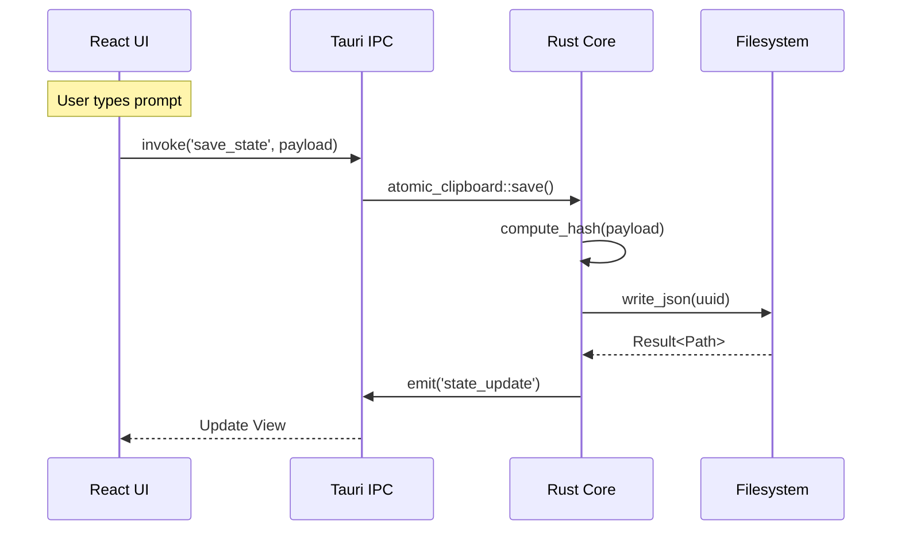

# RFC-9116: SX9 Dev Forge System Architecture

**Status:** Draft
**Date:** 2025-12-20
**Author:** Anti-Gravity (Assistant)
**Area:** 9100-integration

## 1. Executive Summary

`sx9-dev-forge` is the **Local Control Plane** for the SX9 ecosystem. It serves as a secure, high-density "work surface" for prompt engineering, mission deployment, and system maintenance. It bridges the gap between the secure local environment (keys, files, git) and remote infrastructure (Linear, Slack, Cloudflare) via a hardened Rust backend.

## 2. System Architecture

The Forge utilizes a hybrid desktop architecture to deliver "web-speed" UI development with "native-speed" system integration.

### 2.1 Hybrid Stack

- **Frontend**: React 19 + TypeScript + TailwindCSS v4.
  - _Pattern_: **React Native Web Migration** (Shared component lineage with `sx9-ops-main`).
  - _Aesthetic_: **Glyph Rail System** (High-density, icon-driven sidebar navigation).
- **Backend**: Rust (Tauri v2).
  - _Core_: `sx9-foundation-core` (Shared logic with CLI/Servers).
  - _Runtime_: `tokio` (Async I/O).

### 2.2 The Backend Bridge

The Forge does NOT use standard HTTP APIs for internal logic. It uses **Tauri Commands** to invoke Rust functions directly.

| Domain       | Key Capabilities                             | Implementation                    |
| :----------- | :------------------------------------------- | :-------------------------------- |
| **Identity** | Secure credential access (Slack, Linear, CF) | `vault::global_vault()`           |
| **State**    | Persistence of User Intent                   | `AtomicClipboard`                 |
| **Ops**      | Issue Tracking & Notifications               | `LinearClient`, `reqwest` (Slack) |

### 2.3 Component Relationship Diagram

```mermaid
graph TD
    subgraph Frontend ["Frontend (React 19)"]
        UI[Glyph UI System]
        Store[Zustand/Context]
        IPC[Tauri Client API]

        UI --> Store
        Store --> IPC
    end

    subgraph Bridge ["Tauri IPC Bridge"]
        Invoke[Command Invocation]
        Events[Event Channel]

        IPC -->|invoke('cmd')| Invoke
        Events -->|emit('event')| IPC
    end

    subgraph Backend ["Backend (Rust)"]
        Router[Command Router]

        subgraph Core_Services ["Core Services (lib.rs)"]
            Vault[Credential Vault]
            Clipboard[Atomic Clipboard]
            Harness[Agent Harness]
        end

        subgraph Foundation ["sx9-foundation-core"]
            Crypto[Trivariate Hash]
            Runes[Rune Logic]
        end

        Invoke --> Router
        Router --> Vault
        Router --> Clipboard
        Router --> Harness

        Harness --> Foundations
        Clipboard --> Foundations
    end

    subgraph External ["External Systems"]
        FS[(Local Filesystem)]
        API_Slack[Slack API]
        API_Linear[Linear API]

        Vault --> FS
        Clipboard --> FS
        Harness --> API_Slack
        Harness --> API_Linear
    end
```

### 2.4 Data Flow & Operational Mechanics

The Forge operates on a strictly deterministic data lifecycle.

#### 2.4.1 The "Atomic Loop"

Every user interaction triggers the following cycle:

1.  **Ingest (Frontend)**: User interacts with the _Glyph Rail_ or _Hero Workspace_.
2.  **Serialize (Bridge)**: React invokes `atomic_clipboard::save`.
3.  **Identity (Foundation)**: Rust computes the **Trivariate Hash** (`[SCH]_[CUID]_[UUID]`).
4.  **Persist (System)**: Data is written to disk as an immutable JSON artifact.
5.  **Reflect (Frontend)**: New state is pushed back to the UI via Tauri Events.



#### 2.4.2 Mission Execution Flow

When a user activates a Mission (e.g., "Deploy to Production"):

1.  **Context Construction**: The **Agent Harness** loads context (Memory, Linear, Drive).
2.  **Prompt Assembly**: The **PromptScript** is compiled with the loaded context.
3.  **Reasoning**: The LLM (Claude) plans the execution path.
4.  **Tooling**: The Agent invokes specialized tools (e.g., `linear_client`, `slack_api`).
5.  **Audit**: Every tool invocation is logged to the **Atomic Clipboard**.

## 3. Key Systems

### 3.1 Credential Vault

The Forge mounts the user's `~/.sx9/vault` to provide **Zero-Config Authentication**.

- **Mechanism**: On startup, `lib.rs` initializes the global vault.
- **Security**: Keys are never exposed to the frontend DOM; they are consumed strictly within Rust closures.

### 3.2 Atomic Clipboard

The **Atomic Clipboard** is the mandatory state layer.

- **Function**: Every "Mission" or "Idea" generated in the UI is immediately serialized to disk (`.json`) with a UUID.
- **Benefit**: Crash recovery and cross-agent context sharing.

## 4. Infrastructure Targets (Scale-to-Zero)

_Derived from RFC-9004 and RFC-9105_

The Forge deploys to "Serverless" infrastructure to maintain zero idle cost.

### 4.1 Cloudflare (Edge & Storage)

Primary target for frontend assets, edge logic, and object storage.

- **Compute**: Cloudflare Workers (Rust/WASM).
- **Storage**: R2 (S3-compatible, no egress fees).
- **State**: Durable Objects (Atomic coordination).
- **Trigger**: `U+EAxx` Runes (see RFC-9004).

### 4.2 Google Cloud (Compute & AI)

Primary target for containerized workloads and heavy AI inference via ABE.

- **Compute**: Cloud Run (Scale-to-zero containers, 2nd gen execution env).
- **Data**: Firestore (NoSQL document store).
- **AI**: Vertex AI (Gemini 2.5 Flash pipeline).
- **Integration**: Accessed via `sx9-foundation-core` GPC adapters.

## 5. Commissioning & Deployment

### 4.1 Local-First Model

The Forge is commissioned as a **local tool**, not a hosted SaaS.

- **Primary Use**: Running on the developer's machine (`localhost:1420` or `.app` bundle).

### 4.2 Release Pipeline

- **Versioning**: Semantic Versioning (`vX.Y.Z`).
- **CI**: GitHub Actions builds binaries on tag push.
- **Workflow**:
  ```bash
  ./scripts/ship-dev-forge.sh [patch|minor|major]
  ```

## 5. Integration Status (v0.1.0)

| Service        | Status      | Notes                                                            |
| :------------- | :---------- | :--------------------------------------------------------------- |
| **Slack**      | ✅ Active   | Post-deployment notifications.                                   |
| **Linear**     | ✅ Active   | Bi-directional sync (Issues ↔ Missions).                         |
| **Cloudflare** | ⏸️ Reserved | Credential support exists; Provisioning logic descoped for v0.1. |

## 6. Prompt HUD Implementation

_Referenced by RFC-9112 Section 13._

The "Prompt HUD" described in theoretical terms in RFC-9112 is realized here as the **Dev Forge**.

- **Input**: User intent via "Hero Workspace".
- **Processing**: Rust backend (`lib.rs`).
- **Output**: Formalized Prompt Artifacts (YAML/JSON) + Mission Activation.

## 8. Memory & Context Layer

_Derived from `sx9-claude-optimal-usage.md`_

The Forge implements a hierarchical context loading sequence to ground every agentic action.

### 8.1 Context Loading Sequence

Before execution, the Forge constructs the context window from:

1.  **Memory**: `conversation_search` (User preferences, key decisions).
2.  **Linear**: `list_issues` (Project state, dependencies).
3.  **Drive**: `google_drive_search` (Internal documentation).
4.  **Filesystem**: `list_directory` (Current codebase state).
5.  **Web**: `web_search` (External references).

### 7.2 Storage

- **Short-term**: In-memory context window.
- **Long-term**: `AtomicClipboard` (JSON serialization of intent).

## 8. Agentic Harness

_Derived from `sx9-agent-harness-v2.yaml`_

The Forge standardizes agent behavior through "Harnesses" and "Personas".

### 8.1 Harness Modes

| Harness      | Mode         | Temp | Use Case                         |
| :----------- | :----------- | :--- | :------------------------------- |
| **Build**    | SUPERVISED   | 0.2  | Code generation, infrastructure. |
| **Research** | AUTONOMOUS   | 0.4  | Intel gathering, synthesis.      |
| **Security** | STEP-CONFIRM | 0.1  | Audits, sensitive analysis.      |
| **Planning** | SUPERVISED   | 0.3  | Strategy, RFC drafting.          |

### 8.2 Standard Personas

- **FORGE**: Build Engineer (Filesystem, CI/CD).
- **AXIOM**: Systems Architect (Figma, Canva).
- **VECTOR**: Security Engineer (Read-only audits).
- **SENTINEL**: Threat Analyst (MITRE ATT&CK mappings).
