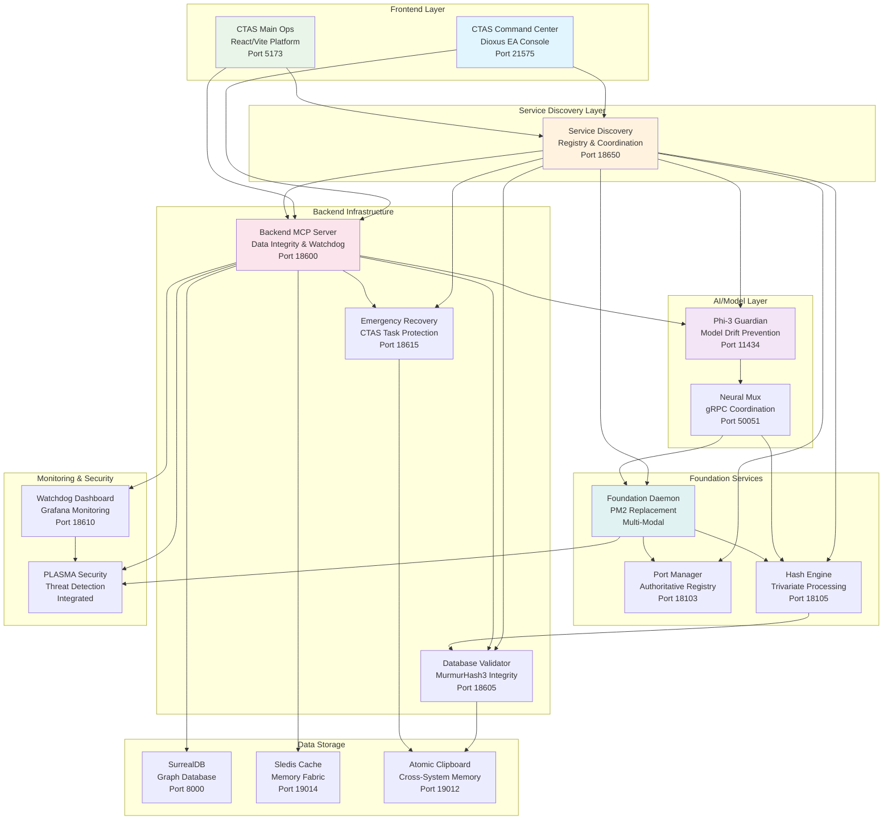
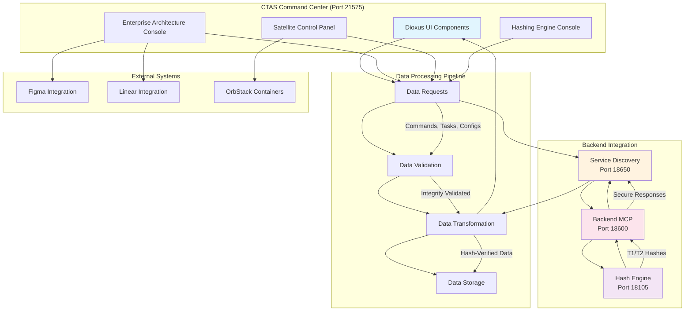
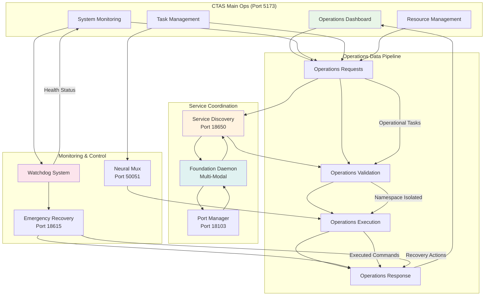
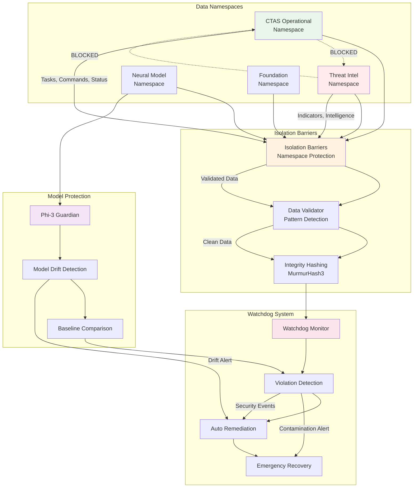
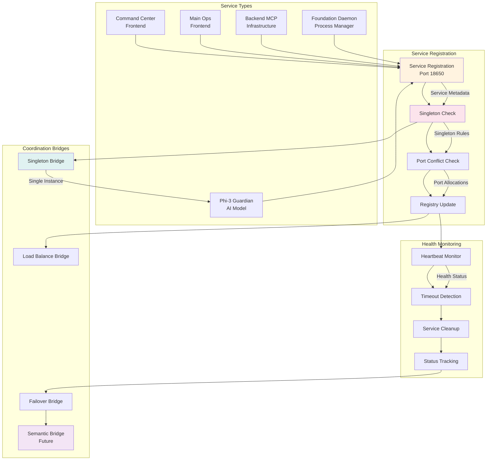
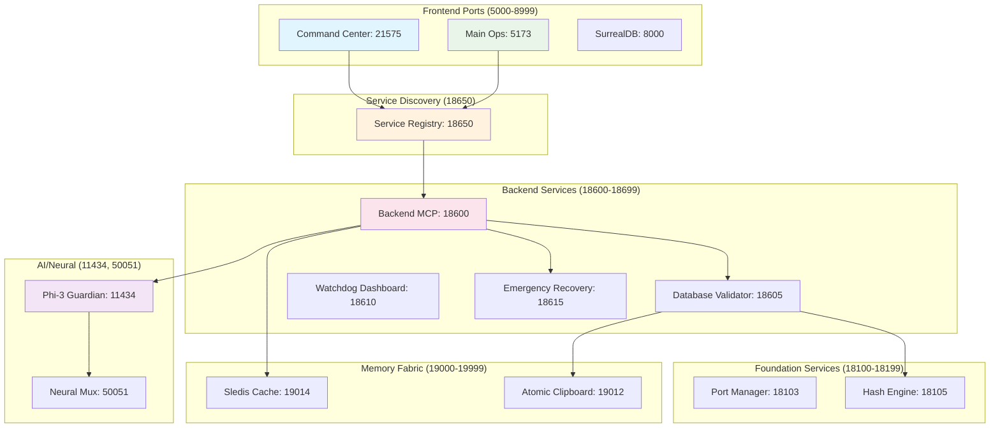
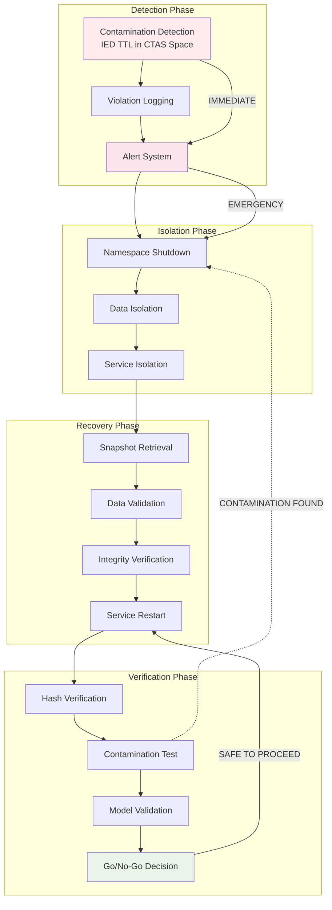

# 🏗️ CTAS-7 System Architecture & Data Flow Diagrams

## 🎯 **System Overview Diagram**

---

## 🔄 **Data Flow Diagram - CTAS Command Center**

---

## 🔄 **Data Flow Diagram - CTAS Main Ops**

---

## 🛡️ **Data Isolation & Security Flow**

---

## 🔄 **Service Discovery & Coordination Flow**

---

## 📊 **Port Allocation & Network Architecture**

---

## 🔍 **Emergency Recovery Data Flow**

---

## 🎯 **Key Integration Points**

### **CTAS Command Center Integration:**
- **Service Discovery Registration** → Prevents duplicate EA consoles
- **Backend MCP Communication** → Secure model context management
- **Hash Engine Integration** → T1/T2 trivariate hash generation
- **Emergency Recovery** → Protects satellite control configurations

### **CTAS Main Ops Integration:**
- **Foundation Daemon Coordination** → Replaces PM2 with enterprise orchestration
- **Watchdog Monitoring** → Real-time operational health tracking
- **Neural Mux Communication** → AI agent coordination
- **Port Manager Integration** → Authoritative port allocation

### **Critical Data Protection:**
- **Namespace Isolation** → CTAS operational vs threat intelligence separation
- **Model Drift Prevention** → Phi-3 baseline protection
- **Emergency Recovery** → Automatic CTAS task restoration
- **Semantic Classification** → Future ontological routing capability

This architecture ensures **no service doubling**, **proper network bridging**, and **critical data protection** while maintaining **high-performance operation** and **enterprise-grade reliability**.