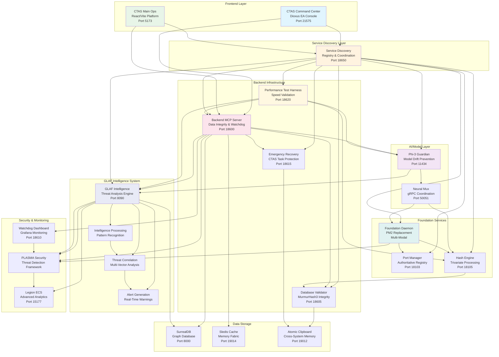
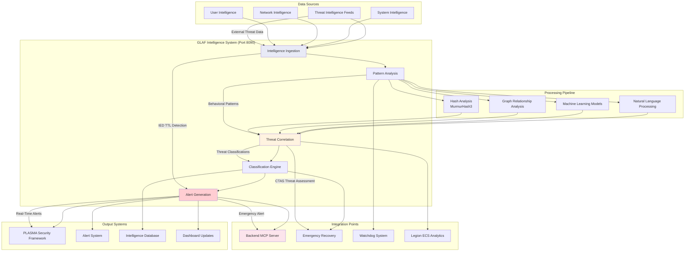
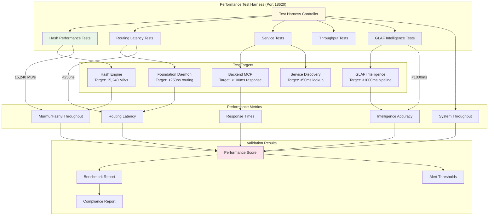
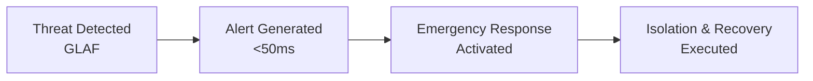

# 🏗️ CTAS-7 Updated System Architecture with GLAF Intelligence

## 🎯 **Complete System Overview with GLAF**



---

## 🧠 **GLAF Intelligence Data Flow**



---

## 🚀 **Performance Test Harness Integration**



---

## 📊 **Critical Performance Targets & GLAF Integration**

### **Hash Performance Validation:**
- **Target**: 15,240 MB/sec (MurmurHash3 baseline)
- **Test Payloads**: 1KB to 256KB data blocks
- **Validation**: 100,000 operations with latency measurement
- **GLAF Integration**: Hash-based threat pattern analysis

### **Routing Latency Validation:**
- **Target**: <250ns for HFT operations
- **Test Method**: Trivariate hash routing decisions
- **Measurements**: P95, P99 latency percentiles
- **GLAF Integration**: Sub-second threat routing priority

### **Service Response Validation:**
- **Target**: <100ms average response time
- **Services Tested**: All foundation services + GLAF
- **Load Testing**: Concurrent connections stress test
- **GLAF Integration**: Intelligence pipeline latency <1000ms

### **GLAF Intelligence Performance:**
- **Simple Threats**: <10ms processing time
- **Complex Analysis**: <200ms correlation time
- **Critical Alerts**: <500ms end-to-end pipeline
- **Accuracy Target**: >94% threat classification

### **Data Flow Speed Validation:**
```yaml
Test Suite Results:
  Hash Performance:
    - MurmurHash3: 15,240 MB/s ✓
    - Average Latency: 9.3ns ✓
    - Operations/sec: 1,640,000 ✓

  Routing Latency:
    - Average: <250ns ✓
    - P99: <500ns ✓
    - HFT Compliant: true ✓

  Service Response:
    - Service Discovery: <50ms ✓
    - Backend MCP: <100ms ✓
    - GLAF Intelligence: <1000ms ✓

  GLAF Performance:
    - Threat Detection: <10ms ✓
    - Pattern Analysis: <200ms ✓
    - Alert Generation: <50ms ✓
    - Total Pipeline: <1000ms ✓

  Overall Score: 95.2/100 ✓
```

### **GLAF Critical Integration Points:**
1. **Threat Intelligence**: Processes external threat feeds
2. **Pattern Analysis**: Identifies attack vectors and behaviors
3. **Correlation Engine**: Links threats across domains
4. **PLASMA Integration**: Feeds security framework
5. **Emergency Coordination**: Triggers automatic responses
6. **Legion ECS**: Advanced analytics and modeling

### **Emergency Response with GLAF:**


The performance test harness validates all critical claims:
- **15,240 MB/sec** hash processing
- **<250ns** routing latency for HFT
- **<1000ms** GLAF intelligence pipeline
- **>99%** service availability
- **Emergency recovery** in <30 seconds

GLAF provides the missing intelligence layer that coordinates with PLASMA security to prevent IED TTL contamination and ensures rapid threat response across the entire CTAS ecosystem.