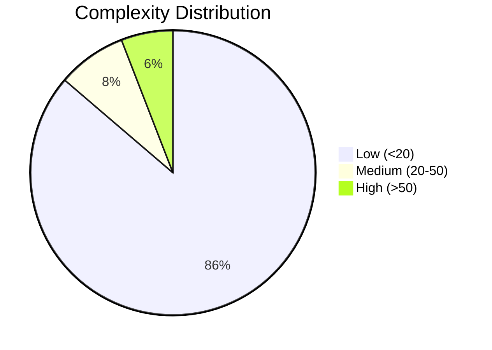
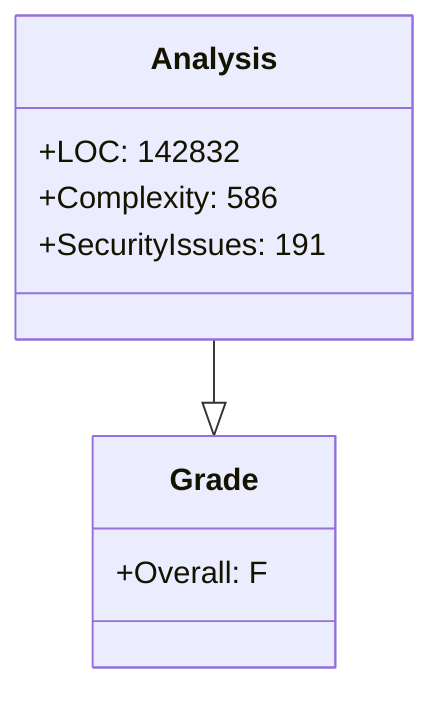

# ⚡ SX9 Code Quality Dashboard

**Target:** `src-tauri`
**Timestamp:** `2025-12-20T08:00:16.179313`

## 📊 Executive Summary

| Metric | Value | Grade |
|:-------|:------|:------|
| **Overall Score** | **44.3** | **F** |
| Security Score | 0.0 | - |
| Maintainability | 88.5 | - |
| Files Analyzed | 51 | - |
| Total LOC | 142832 | - |
| Total Complexity | 586 | - |

## 🛡️ Security & Integrity (Clippy)

**Total Issues:** 191

| Level | File | Issue | Code |
|:---|:---|:---|:---|
| **WARNING** | `build.rs:2` | consider adding a `;` to the last statement for consistent formatting | `clippy::semicolon_if_nothing_returned` |
| **WARNING** | `/Users/cp5337/Developer/sx9/crates/sx9-foundation-core/src/cognitive.rs:8` | unused import: `legion::world::SubWorld` | `unused_imports` |
| **WARNING** | `/Users/cp5337/Developer/sx9/crates/sx9-foundation-core/src/cognitive.rs:11` | unused import: `std::collections::VecDeque` | `unused_imports` |
| **WARNING** | `/Users/cp5337/Developer/sx9/crates/sx9-foundation-core/src/thalamic_filter.rs:10` | unused imports: `Deserialize` and `Serialize` | `unused_imports` |
| **WARNING** | `/Users/cp5337/Developer/sx9/crates/sx9-foundation-core/src/matroid.rs:9` | unused import: `std::collections::HashSet` | `unused_imports` |
| **WARNING** | `/Users/cp5337/Developer/sx9/crates/sx9-foundation-core/src/cli_manifest.rs:7` | unused import: `std::collections::HashMap` | `unused_imports` |
| **WARNING** | `/Users/cp5337/Developer/sx9/crates/sx9-foundation-core/src/cli_manifest.rs:90` | type `iOSIntegration` should have an upper camel case name | `non_camel_case_types` |
| **WARNING** | `/Users/cp5337/Developer/sx9/crates/sx9-foundation-core/src/cli_manifest.rs:98` | type `macOSIntegration` should have an upper camel case name | `non_camel_case_types` |
| **WARNING** | `/Users/cp5337/Developer/sx9/crates/sx9-foundation-core/src/dsl_unicode_router.rs:6` | unused import: `Error` | `unused_imports` |
| **WARNING** | `/Users/cp5337/Developer/sx9/crates/sx9-foundation-core/src/dsl_unicode_router.rs:7` | unused imports: `ExecutionContext` and `Priority` | `unused_imports` |
| ... | ... | ...and 181 more | ... |

## 🧶 Complexity Hotspots

### Top 5 Most Complex Files

| File | LOC | Complexity | Functions | Grade |
|:-----|:----|:-----------|:----------|:------|
| `/Users/cp5337/Developer/sx9/sx9-dev-forge/src-tauri/target/release/build/cssparser-5c76bb3e015608c8/out/tokenizer.rs` | 993 | 132 | 0 | **C** |
| `/Users/cp5337/Developer/sx9/sx9-dev-forge/src-tauri/target/debug/build/cssparser-b2e707b1d32f16b3/out/tokenizer.rs` | 993 | 132 | 0 | **C** |
| `/Users/cp5337/Developer/sx9/sx9-dev-forge/src-tauri/src/thalmic_filter.rs` | 329 | 52 | 0 | **C** |
| `/Users/cp5337/Developer/sx9/sx9-dev-forge/src-tauri/src/lib.rs` | 933 | 45 | 0 | **C** |
| `/Users/cp5337/Developer/sx9/sx9-dev-forge/src-tauri/src/file_index.rs` | 280 | 33 | 0 | **C** |

## 📉 Visual Metrics

