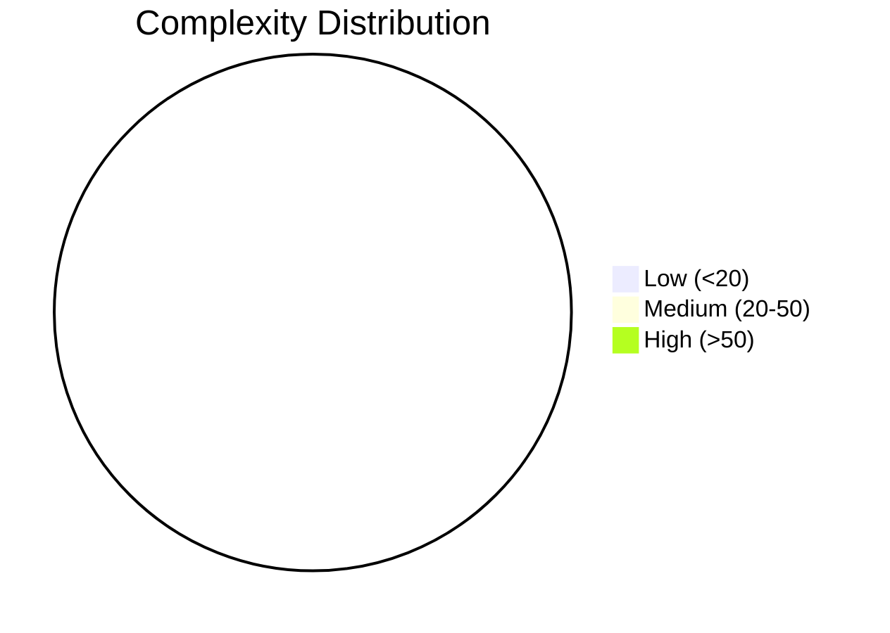
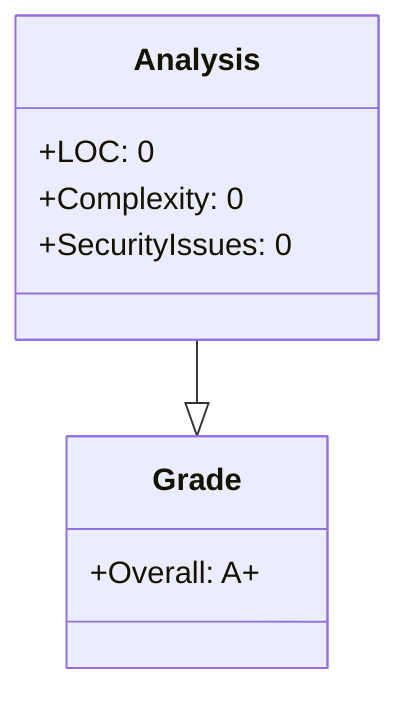

# ⚡ SX9 Code Quality Dashboard

**Target:** `crates`
**Timestamp:** `2025-12-20T17:51:22.591903`

## 📊 Executive Summary

| Metric | Value | Grade |
|:-------|:------|:------|
| **Overall Score** | **100.0** | **A+** |
| Security Score | 100.0 | - |
| Maintainability | 100.0 | - |
| Files Analyzed | 0 | - |
| Total LOC | 0 | - |
| Total Complexity | 0 | - |

## 🛡️ Security & Integrity (Clippy)

**Total Issues:** 0

_No security issues detected. Clean run!_ ✅

## 🧶 Complexity Hotspots

### Top 5 Most Complex Files

| File | LOC | Complexity | Functions | Grade |
|:-----|:----|:-----------|:----------|:------|

## 📉 Visual Metrics

